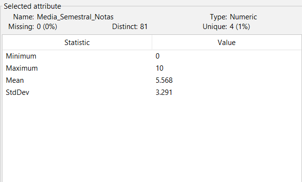
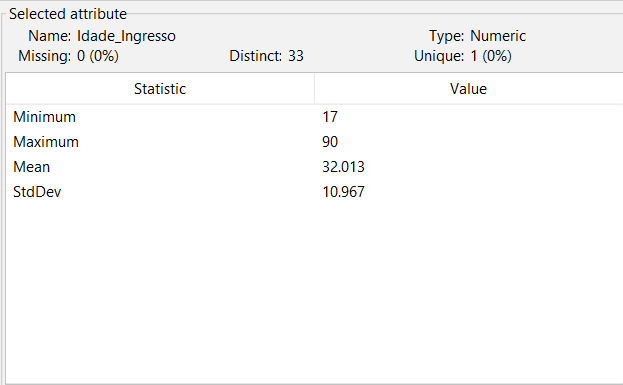
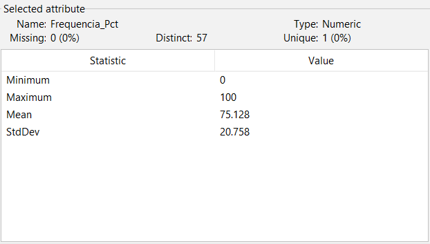
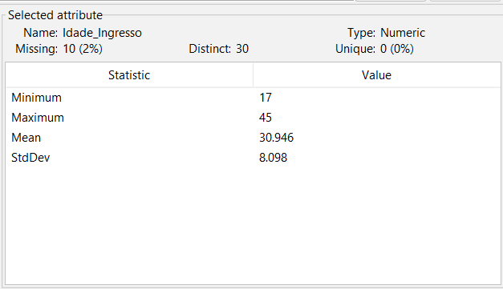
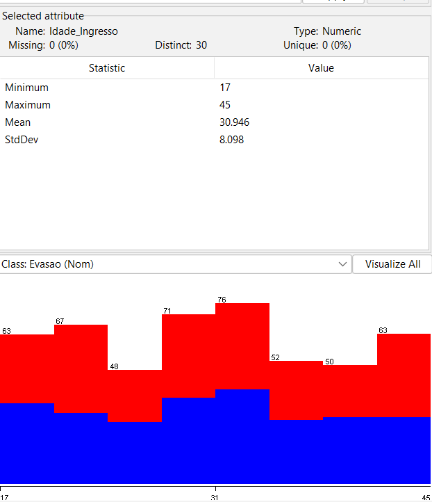
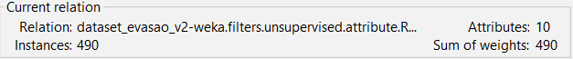
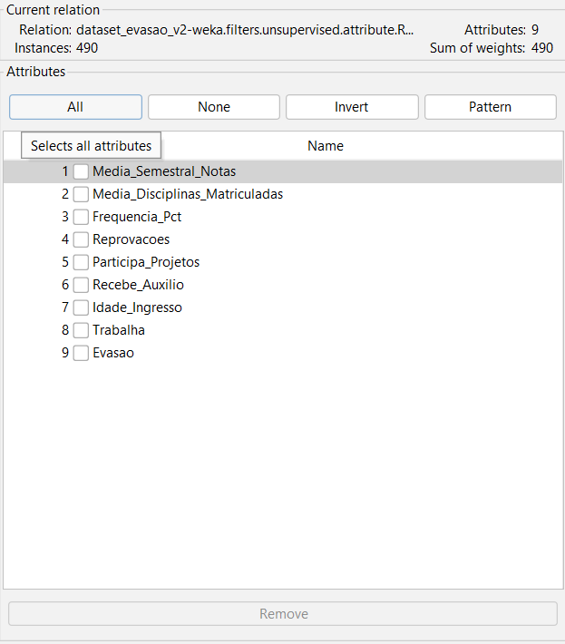
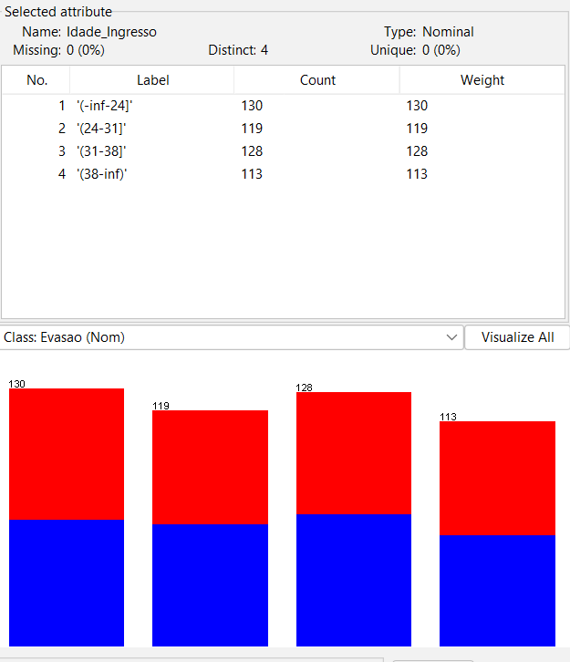

# **Pré-Processamento**

O pré-processamento foi conduzido com base nos achados do teste piloto, garantindo que cada decisão possui justificativa metodológica clara, seguindo o princípio de **"Garbage in, Garbage out"** discutido em sala de aula. As etapas contemplam limpeza, transformação e redução dos dados, e a ordem de aplicação dos filtros foi definida criteriosamente para evitar conflitos de índice e garantir que cada filtro opere sobre dados já estabilizados pelas etapas anteriores.

## Ordem do filtro a aplicar

| Ordem | Filtros | Atributo Alvo | Objetivo |
| --- | --- | --- | --- |
| 1º | ReplaceMissingValues | Todos | Tratar valores faltantes |
| 2º | MathExpression | Frequencia_Pct | Corrigir os valores negativos antes de qualquer remoção de instâncias |
| 3º | NumericCleaner | Idade_Ingresso | Marca as idades acima de 61.5 como missing |
| 4º | RemoveWithValues | Idade_Ingresso | Remove as instâncias marcadas como missing pelo passo anterior |
| 5º | Remove | Dia_Matricula | Remover o atributo irrelevante - feito depois das limpezas para evitar conflito de índices |
| 6º | Discretize | Idade_Ingresso | Discretizar idade em faixas |
|  |  |  |  |

# Tratar valores Faltantes

## Objetivo

Substituir os valores faltantes encontrados em alguns atributos dentro do dataset, neste caso, os valores faltantes estariam nos atributos **Media_Semestral_Notas** e **Idade_Ingresso,** totalizando um total de 49 valores faltantes dentro destes dois atributos. **ReplaceMissingValues** Vai ser o filtro utilizado para fazer o tratamento desses valores faltantes

### Media_Semestral_Notas

### **Idade_Ingresso**

## Resultado

Os valores faltantes dentro de todos os atributos foram removidos. Na analise feita os atributos  **Media_Semestral_Notas** e **Idade_Ingresso** eram os atributos que possuiam valores faltantes

# Remover outilers negativos

## Objetivo

Substituir os valores negativos presentes no atributo **Frequencia_Pct** por 0, utilizando o filtro **MathExpression**. Valores negativos de frequência são fisicamente impossíveis e foram identificados no teste piloto como ruído intencional.

### Frequencia_Pct

## Resultado

Os valores negativos foram substituídos por 0 no atributo **Frequencia_Pct**. O valor mínimo passou de **-13 para 0**, eliminando os registros impossíveis sem remover as instâncias do dataset. A média e o desvio padrão também foram levemente ajustados, refletindo a correção dos valores.

# Remover Outliers Acima de 61 Anos

## Objetivo

O atributo **Idade_ingresso** possui ~10 instâncias acima de 61,5 anos (limite IQR), incluindo o outlier extremo de 90 anos. Esses registros são implausíveis para ingresso em graduação e serão removidos em duas etapas: primeiro o filtro NumericCleaner marca essas instâncias como missing, e em seguida o **RemoveWithValues** as elimina do dataset.

### Idade_Ingesso

### com NumericCleaner

### Com RemoveWithValues

## Resultado

As instâncias com **Idade_Ingresso** acima de 61,5 anos foram removidas do dataset, incluindo o outlier extremo de 90 anos. O total de instâncias reduziu de **500 para aproximadamente 490**, e o valor máximo do atributo passou a refletir apenas idades plausíveis para ingresso em graduação.

# Remover atributo irrelevante

## Objetivo

Remover o atributo **Dia_Matricula** do dataset, pois foi confirmado no teste piloto como um atributo irrelevante — sem qualquer relação semântica com a evasão acadêmica. Sua distribuição de classes era praticamente idêntica em todos os dias da semana, indicando que não contribui com informação útil para os modelos de classificação. A remoção será realizada com o filtro **Remove** do Weka.

### Dia_Matricula

## Resultado

O atributo **Dia_Matricula** foi removido com sucesso do dataset. O número de atributos passou de **10 para 9**, conforme confirmado no painel **Current relation** do Weka, que exibe a quantidade de atributos igual a **9**. A remoção garante que os algoritmos de classificação não aprendam padrões baseados em uma informação administrativa sem poder preditivo, evitando que o modelo seja influenciado por ruído irrelevante durante o treinamento.

# Discretização

## Objetivo

Transformar o atributo numérico **Idade_Ingresso** em faixas etárias categóricas utilizando o filtro **Discretize**. Este é o **filtro extra não visto em sala**, exigido pelo enunciado. A discretização enriquece a representação dos dados e facilita a interpretação pelas Árvores de Decisão, agrupando idades em intervalos com significado acadêmico.

### **Idade_Ingresso**

## Resultado

O atributo **Idade_Ingresso** foi transformado de numérico para nominal, dividido em **4 faixas etárias** geradas automaticamente pelo Weka. Essa transformação permite que algoritmos como Árvore de Decisão e Naive Bayes trabalhem com o conceito de faixa etária em vez de valores numéricos contínuos, potencialmente melhorando a interpretabilidade dos modelos.

# Considerações Finais do Pré-processamento

O pré-processamento do dataset **dataset_evasao** foi conduzido de forma estruturada e orientada pelos achados identificados no teste piloto, garantindo que nenhuma decisão fosse tomada de forma mecânica. Ao longo das seis etapas aplicadas, o **dataset** passou por transformações essenciais que o tornaram adequado para o treinamento dos algoritmos de classificação.

Os valores faltantes presentes nos atributos **Media_Semestral_Notas** e **Idade_Ingresso** foram tratados com o filtro **ReplaceMissingValues**, eliminando os 49 registros ausentes sem comprometer o volume de dados. Os outliers negativos de **Frequencia_Pct** foram corrigidos pelo filtro **MathExpression**, substituindo valores impossíveis por 0 e preservando as instâncias. As idades implausíveis acima de 61,5 anos em **Idade_Ingresso** foram removidas com a combinação dos filtros **NumericCleaner** e **RemoveWithValues**, resultando na eliminação de aproximadamente 10 instâncias inconsistentes. O atributo irrelevante **Dia_Matricula** foi excluído com o filtro Remove, reduzindo o **dataset** de 10 para 9 atributos. Por fim, o atributo **Idade_Ingresso** foi discretizado em faixas etárias com o filtro Discretize, enriquecendo a representação dos dados para os algoritmos.

O dataset pré-processado resultante está limpo, consistente e semanticamente coerente com o problema de predição de evasão acadêmica, estando apto para avançar para as etapas de visualização de dados, modelagem e avaliação dos algoritmos de classificação no Weka.
