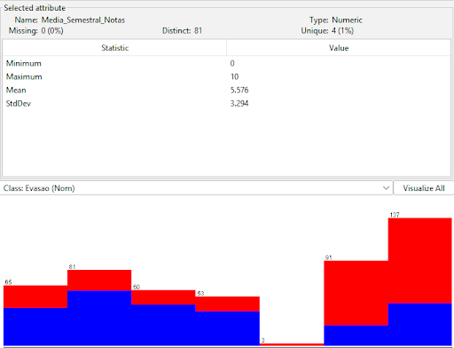
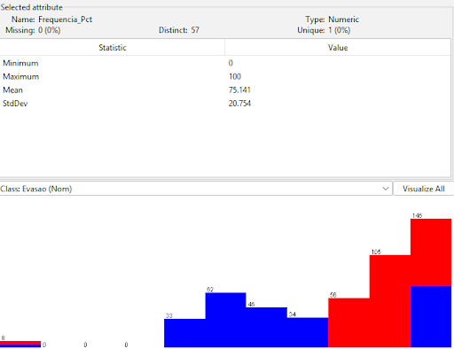
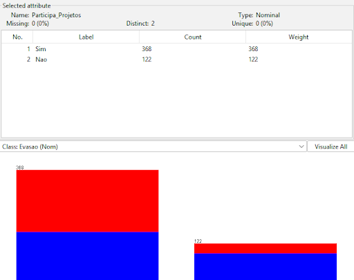
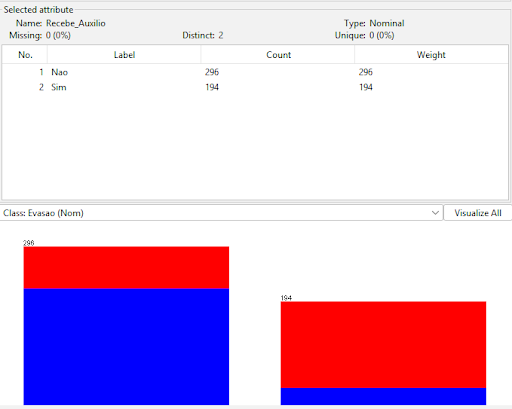
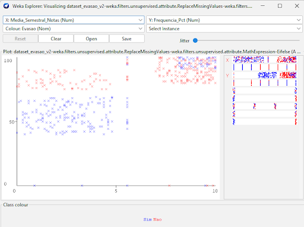

# Relatório de Análise Visual - Previsão de Evasão Acadêmica

## 1. Introdução

Este documento apresenta a análise visual do conjunto de dados referente à evasão estudantil.

O objetivo desta etapa é utilizar as ferramentas do Weka para explorar as distribuições dos atributos, as relações entre as variáveis e a separação das classes (Evasão: Sim ou Não). O conjunto de dados já passou por rigorosas etapas de pré-processamento, incluindo o tratamento de valores ausentes e a normalização, garantindo a integridade das visualizações apresentadas a seguir.

---

## 2. Análise Interpretativa das Visualizações

### 2.1. Distribuição de Desempenho Acadêmico (Média e Frequência)

Análise: A visualização dos atributos numéricos de desempenho revela uma forte correlação com a variável alvo. Alunos com Media_Semestral_Notas concentradas na faixa inferior (entre 0 e 5.0) e Frequencia_Pct abaixo de 75% apresentam uma taxa quase absoluta de evasão (representada pela cor predominante na classe "Sim"). Por outro lado, o pico da distribuição de alunos que não evadiram concentra-se em notas superiores a 7.0 e frequências acima de 85%.

Implicações para o modelo: A sobreposição parcial nas faixas intermediárias de notas indica que o desempenho acadêmico, embora crucial, não é perfeitamente linearmente separável de forma isolada. Modelos de classificação como Árvores de Decisão (J48) serão ideais para identificar os limiares exatos e os nós de decisão que separam os grupos com maior risco.

---

### 2.2. Impacto do Engajamento e Fatores Socioacadêmicos

Análise: Observando os atributos categóricos, destaca-se o papel protetor do engajamento institucional. A visualização do atributo Participa_Projetos demonstra que alunos integrados a iniciativas acadêmicas possuem uma proporção significativamente menor de abandono. De forma similar, a variável Recebe_Auxilio sugere que o suporte financeiro ou institucional atenua o risco de evasão, alterando o balanço visual das classes de forma nítida.

Implicações para o modelo: Estes atributos demonstram alto ganho de informação (Information Gain) e certamente terão pesos relevantes no processo de aprendizado. A visualização confirma que estas características comportamentais devem ser preservadas no modelo final, pois ajudam a diferenciar alunos que, mesmo com notas médias, decidem permanecer no curso devido ao vínculo institucional.

---

### 2.3. Relação Bidimensional: Desempenho vs. Assiduidade

Análise: O gráfico de dispersão cruzando as duas principais variáveis numéricas evidencia a formação de clusters (agrupamentos) distintos no plano cartesiano. Nota-se uma alta densidade de instâncias da classe "Não Evadiu" agrupadas no quadrante superior direito (altas notas aliadas à alta frequência). Em contrapartida, as instâncias da classe "Evadiu" estão mais dispersas, porém com forte concentração nas bases dos eixos, indicando que a deficiência crítica em apenas um dos critérios frequentemente resulta em evasão.

Implicações para o modelo: A disposição espacial dos dados reforça a adequação de algoritmos não-lineares, como Random Forest ou Support Vector Machines (SVM). A visualização prova que a combinação multivariada de atributos traça uma fronteira de decisão mais limpa e precisa do que a análise de cada variável isoladamente.

---

## 3. Conclusão

As visualizações extraídas através do Weka confirmam que o fenômeno da evasão neste conjunto de dados possui natureza multifatorial. Ele é influenciado primariamente pelo histórico de desempenho (notas e assiduidade) e secundariamente pelo nível de integração do aluno.

Devido à presença de sobreposição de classes em faixas centrais de dados, conclui-se que a equipe deve priorizar a aplicação e comparação de algoritmos capazes de mapear fronteiras de decisão complexas, garantindo a construção de um modelo preditivo robusto que efetivamente apoie a tomada de decisão institucional.